### Hello

I'm an **AI & Automation Engineer at Resurgent India**. I turn slow, manual, high-stakes work into software that runs itself.

My systems screen people and companies against **12 million+ sanctions and risk records**, and they write **bank-ready credit reports in minutes instead of weeks**. They run in production and are used every day by analysts, bankers and client teams. I care about AI that is **fast, verifiable and actually trusted with real decisions**.

---

## 01 — What I do

<table>
<tr>
<td width="33%" valign="top">

### Agentic AI
Multi-step LLM agents that research, reason and write, with **verification built in**: second-opinion reviewers, fact-checks and source citations on every answer.

</td>
<td width="33%" valign="top">

### Automation at scale
Pipelines that replace manual work end to end: **800-source web scraping**, document OCR, self-healing jobs, alerts and one-click report generation.

</td>
<td width="33%" valign="top">

### Production engineering
APIs, data platforms and full-stack apps that **stay up**: PostgreSQL at 12M+ rows, AWS deployments, monitoring and hundreds of automated tests.

</td>
</tr>
</table>

---

## 02 — Flagship systems

**[Argus](https://github.com/Aaayyuusshhh/argus-aml-intelligence-engine) is a global anti-money-laundering and sanctions intelligence engine.**
- Collects **800 official watchlists** (OFAC, UN, EU, Interpol, SEBI, RBI and more) from **90+ countries** into one **12.2-million-record** database.
- Answers *"Is this person or company on any list, and where's the proof?"* in about **0.2 seconds**, with a link to the original government source.
- Runs as a **REST API, a web console and an AI-agent tool (MCP)**, and other company products are built on top of it.
- Refreshes itself daily, spots broken sources and heals them automatically.

 

**[Atlas](https://github.com/Aaayyuusshhh/atlas-agentic-credit-intelligence) is the AI credit-intelligence platform behind [resurgentindia.ai](https://resurgentindia.ai).**
- From a single company ID it produces **bank-ready deliverables**: credit workbooks, board notes in 24 bank formats, forensic audits, valuations and AML reports.
- Cuts work that took analysts **weeks down to minutes**, and every figure traces back to its source document.
- A **live SaaS** used across the company and by client teams, with a web app, a **native iOS app** and a partner API.

---

## 03 — How it all connects

---

## 04 — Impact in numbers

---

## 05 — More projects

| Project | What it does |
|:--|:--|
| **[Autonomous Finance Agent](https://github.com/Aaayyuusshhh/LLM-Based-Autonomous-Finance-Agent)** | An AI analyst that answers questions over **live market data**, using retrieval-augmented generation (RAG) with LangChain and FAISS for sub-second answers. |
| **[IntelliExam](https://github.com/Aaayyuusshhh/IntelliExam-AI-Powered-Examination-Platform)** | AI exam grading used on **500+ real student submissions**, replacing manual checking with consistent, rubric-based scoring. |
| **[Sentiment Auto-Reply](https://github.com/Aaayyuusshhh/Social-Media-Sentiment-Analysis-AI-Auto-Reply-System)** | A bot on **Instagram and Facebook** (Meta APIs) that reads the sentiment of each message and replies automatically, with zero manual replies after launch. |
| **[EfficienC Automation Agent](https://github.com/Aaayyuusshhh/EfficienC-automation-agent)** | A workflow-automation agent that connects business tools and removes repetitive manual steps. |
| **Published research · PsyArXiv 2025** | A hybrid deep-learning model (CNN + Random Forest) for detecting postpartum depression, reaching **AUC 0.973** and designed for wearables and telehealth. |

---

## 06 — Technical toolbox

  

---

## 07 — How I build

| Principle | In practice |
|:--|:--|
| **AI must be checkable** | Every AI answer links back to the document or record it came from. |
| **Never invent a number** | Real figures come from real sources. Gaps stay visibly empty, never guessed. |
| **Automate the boring, guard the critical** | Machines do the repetitive work; tests, audits and alerts protect what matters. |
| **Ship, then measure** | Production usage, uptime and accuracy decide what gets built next. |

---

### Let's build something that matters

I enjoy hard problems where **correctness matters**: finance, compliance and data at scale. 
If that sounds like your team, **[let's talk on LinkedIn](https://linkedin.com/in/aayush-katyal-b71a4a261)** or **[drop me an email](mailto:aayushkatyal.14@gmail.com)**.

